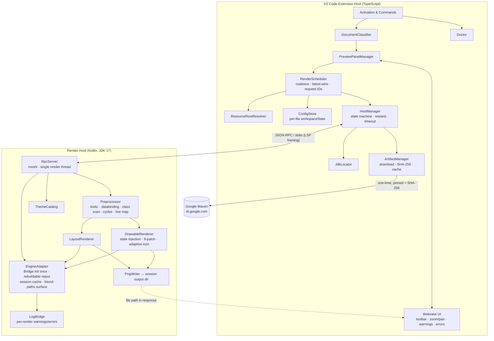

# Inflate — Android XML Preview: Design

**Spec**: `.specs/features/android-xml-preview/spec.md`
**Status**: Approved (user, 2026-07-19)
**Date**: 2026-07-19
**Conforms to**: AD-001…AD-008 (all active, none superseded). New decisions recorded as AD-009…AD-012.

---

## Research Findings (primary-source verified, 2026-07-19)

All findings below were verified against the Paparazzi **1.3.5 git tag** (source files), the published **paparazzi-1.3.5.pom** (Maven Central), and **Google Maven** (HTTP HEAD checks). They resolve the spec's open questions Q1–Q4.

### Q1 residue — exact engine pairing ✅ RESOLVED
- Paparazzi 1.3.5 pins **layoutlib 14.0.11** (Android 14 / API 34 line) via `gradle/libs.versions.toml`; also `layoutlib-api` 31.4.2, `com.android.tools:common` 31.4.2, `sdk-common` 31.4.2, `ninepatch` 31.4.2 (all compile-scope deps in the published POM).
- The layoutlib artifacts are consumed as **plain directories + jars**, wired by exactly two system properties read in `Renderer.prepare()`: `paparazzi.layoutlib.runtime.root` (unzipped `layoutlib-runtime-14.0.11-<os>.jar`: `build.prop`, `data/fonts`, `data/icu/icudt72l.dat`, `data/keyboards/Generic.kcm`, `data/{mac|mac-arm|win|linux}/lib64` natives) and `paparazzi.layoutlib.resources.root` (unzipped `layoutlib-resources-14.0.11.jar`: `res/`).
- **Independent layoutlib bump: NO for v1.** `layoutlib:14.0.11` is a compile-scope dependency of the paparazzi jar (bridge + framework classes on the classpath); bumping the runtime/resources directories independently would desync classes from natives/resources. The pin moves as one matrix (D6 confirmed).
- Paparazzi's own JVM floor is 11 (`checkInstalledJvm`); our floor stays **JDK 17** per AD-008.
- Compose is **not** in the published dependency list; all Compose paths in `PaparazziSdk` are guarded by classpath probes (`isPresentInClasspath`). The host ships without Compose.

### Q3 — arbitrary-file rendering ✅ RESOLVED (overlay + resource-name inflation, public API)
- `Environment` is a public constructor: `appTestDir, packageName, compileSdkVersion, resourcePackageNames, localResourceDirs, moduleResourceDirs, libraryResourceDirs, allModuleAssetDirs, libraryAssetDirs`. We construct it directly — `detectEnvironment()`'s system-property/JSON flow is bypassed entirely.
- Layout/drawable resources are **file-backed and re-read from disk on every render**: `PaparazziCallback.getParser()` → `LayoutPullParser.createFromFile(...)`. Only `values*/` content (colors, dimens, strings, styles/themes) is parsed *into* the repository at build time.
- Render path for the previewed file: preprocess → write to a fixed **overlay res dir** under a **unique generated name** (`layout/inflate_preview__<docHash>.xml`) → overlay dir is one of `localResourceDirs` → resolve id via `Resources.getIdentifier(name, type, appPackage)` → inflate. Unique naming sidesteps duplicate-resource shadowing semantics entirely; references inside the copy resolve against the real project roots.
- `PaparazziSdk` exposes `layoutInflater` (a `BridgeInflater`), `context`, `resources`, and public `snapshot(view: View)` — the host can build and snapshot arbitrary view trees.

### Q2 — drawable state injection ✅ RESOLVED (high confidence; M0 confirms empirically)
- The host compiles against layoutlib's framework classes (precedent: Paparazzi itself imports `android.view.View`, `android.view.BridgeInflater`). So the host can instantiate views/drawables programmatically inside the session: `resources.getDrawable(id, theme)` → `drawable.state = intArrayOf(android.R.attr.state_pressed, …)` → wrap in a host-owned view → `snapshot(view)`.
- Matched-item indicator: `StateListDrawable.findStateDrawableIndex()` / `getStateDrawable(i)` are public framework API since API 29; layoutlib 14.0.11 implements API 34. Fallback (Q2 scope fallback from spec) remains re-inflating the selector per state.

### Q4 — download size ✅ RESOLVED (measured via HTTP HEAD, Google Maven)
| Artifact | Size |
| -------- | ---- |
| `layoutlib-14.0.11.jar` (bridge + framework classes) | 50.6 MB |
| `layoutlib-runtime-14.0.11-mac-arm.jar` (natives/fonts/ICU) | 75.5 MB |
| `layoutlib-runtime-14.0.11-mac.jar` (x64 variant) | 76.0 MB |
| `layoutlib-resources-14.0.11.jar` (framework res) | 33.2 MB |
| Top-level androidx/Material AARs (material 2.3 + appcompat 1.1 + constraintlayout 0.5 + core 1.3 + others) | ≈ 6.1 MB |
| Transitive androidx closure (annotation, collection, lifecycle, savedstate, activity, transition, vectordrawable, …) | ≈ 5–10 MB (exact via lockfile, see D4) |

**Per-user one-time download ≈ 165–175 MB** (one OS/arch) — inside the spec's 150–250 MB estimate. First-run UX copy should say "~170 MB".

### Additional load-bearing facts found in source
1. **Process-global engine state**: `PaparazziSdk.prepare()` creates `Renderer`/`sessionParamsBuilder` in a **companion object guarded by `isInitialized`** — one resource-repository set per JVM, built once. Hot reload therefore cannot use stock `PaparazziSdk.prepare()` for repository refresh (drives AD-009 and the EngineAdapter design below).
2. **Repository build is separable from Bridge init**: in `Renderer.prepare()`, `FrameworkResourceRepository` / `AppResourceRepository` / `AarSourceResourceRepository` are constructed *before and independently of* `Bridge().init(...)` (native/font/ICU load). We init Bridge **once per process** and rebuild only the app-level repository on invalidation.
3. **Qualifier matching is Studio's own machinery**: `SessionParamsBuilder.build()` calls `getConfiguredResources(deviceConfig.folderConfiguration)` and constructs a fresh `ResourceResolver` per session; `DeviceConfig` (public) exposes `nightMode`, `density`, `orientation`, `screenWidth/Height`, `uiMode`, `fontScale`, `locale`, `size`, `softButtons`, `screenRound` and derives `folderConfiguration` — RES-03 and CFG-01/02/03 map 1:1 onto it.
4. **Custom views**: `PaparazziCallback.loadView` throws `ClassNotFoundException` upward; layoutlib's `BridgeInflater` then falls back to its **MockView** (labeled gray box — the same thing Studio shows). AD-007's placeholder is largely free; we add the warnings-strip entry from our log bridge + preprocessor class pre-scan. (M0 visually confirms MockView fallback.)
5. **Theme handling**: `SessionParamsBuilder.withTheme("android:Theme…" | "ProjectTheme", isProjectTheme)` handles both namespaces; project themes come from `localResourceDirs` styles, Material/AppCompat themes from `libraryResourceDirs` AAR res. `?attr` chains ride `ResourceResolver` (LAY-06).
6. **AppCompat/Material inflation**: Paparazzi installs a hardcoded `AppCompatViewInflater` Factory2 when `appCompatEnabled=true`. That silently downgrades `<Button>` → `AppCompatButton` under Material themes (Studio honors the theme's `viewInflaterClass` → `MaterialComponentsViewInflater` → `MaterialButton`). We pass `appCompatEnabled=false`-equivalent behavior and install **our own theme-aware Factory2** (reads `viewInflaterClass` from the resolved theme, reflectively instantiates, falls back to AppCompat's) for Studio-parity.
7. **Image sizing**: `useDeviceResolution=true` disables Paparazzi's thumbnail downscale — we always render at full device pixels; `RenderingMode.SHRINK` gives wrap-content canvases (drawable intrinsic sizing). `onNewFrame(BufferedImage)` is the image sink.
8. **RecyclerView**: layoutlib ships a built-in empty adapter shim (`com.android.layoutlib.bridge.android.androidx.Adapter`) that `PaparazziCallback.loadClass` wires up — LAY-07's empty-render comes from the engine itself.
9. **JSON + XML libs already on the host classpath** via Paparazzi's deps: moshi 1.15.1 (host RPC codec — no new JSON lib), kxml2 2.3.0 (preprocessor parser), `com.android.tools:ninepatch` 31.4.2 (source-format `.9.png` handling, DRW-05).

**Remaining empirical unknowns (M0 gate, none block design):** MockView fallback visual; `-Xfriend-paths` compile against the 1.3.5 jar; drawable state injection end-to-end; source `.9.png` render path; adaptive-icon mask compositing; repository rebuild latency on a real tree.

---

## Architecture Overview

Two processes, one protocol, one engine:

- **Extension host (TypeScript, Node)** — everything VS Code: activation, document eligibility, resource-root discovery, JDK detection, artifact download/cache, render scheduling (coalescing, latest-wins), host process lifecycle (state machine, restarts), webview panels (toolbar, zoom/pan, warnings, errors), per-file config persistence, Doctor.
- **Render host (Kotlin, JDK 17 subprocess)** — everything Android: engine bootstrap (Bridge init once), resource repositories (rebuildable), preprocessing (`tools:`, data-binding unwrap, custom-class scan, include-cycle check), layout/drawable rendering through PaparazziSdk/layoutlib, theme catalog, warning/error collection with line mapping, PNG output to disk.
- **Protocol** — LSP-style header-framed JSON-RPC over stdio (AD-010). Images travel **by file path** (host writes PNG into a session output dir; webview loads it via `asWebviewUri` + cache-busting query), never as base64 in JSON.



### Render request lifecycle (happy path)

1. Save (or config change / refresh) → `RenderScheduler` coalesces per document, stamps request ID.
2. Scheduler asks `ResourceRootResolver` (cached per document, invalidated on config/fs changes) for ordered roots + package name, merges `ConfigStore` state, dispatches via `HostManager` (state must be `ready`).
3. Host `Preprocessor` produces the overlay copy + line map + dependency name-list; `EngineAdapter` ensures a session for (roots, package, config) — reusing the live session when only the previewed file changed, rebuilding the app repository when `values*/`/file-set changes were signaled, applying `unsafeUpdateConfig`-equivalent when only config changed.
4. Renderer inflates `@layout/inflate_preview__<hash>` (or loads the drawable) inside the session, snapshots, writes `<renderId>.png`.
5. Response returns png path, image size, warnings, mapped errors, dependency file list, timings. Extension updates webview (or shows error panel keeping last good render, stale-dimmed), registers dependency watchers for hot reload.

---

## Finalized Architecture Decisions (spec §D2–D6 closed)

### D2 — Engine sourcing & packaging: **Paparazzi-as-library, internal access via friend-paths** *(→ AD-009)*

The spec's leaning is confirmed, with one refinement forced by finding #1 (process-global companion state): stock `PaparazziSdk.prepare()` cannot rebuild resource repositories, which hot reload (P1-F) and multi-root sessions require. The host therefore:

- Depends on the pinned `app.cash.paparazzi:paparazzi:1.3.5` jar for the battle-tested machinery: vendored Studio resource repositories (`internal.resources.*`), `LayoutPullParser`, bytecode interceptors, `DeviceConfig`, bridge bootstrap sequence.
- Compiles its `EngineAdapter` module with **`-Xfriend-paths=<paparazzi-1.3.5.jar>`** so Kotlin-`internal` classes (`Renderer`'s constituent parts, `SessionParamsBuilder`, `PaparazziCallback`, `LayoutPullParser`, `PaparazziLogger`) are directly usable. The adapter re-implements the ~60 lines of `Renderer.prepare()` as two separable steps: `initBridgeOnce()` (system props, fonts/ICU/natives, `Bridge().init`) and `buildRepositories(roots)` (rebuildable). Snapshot choreography (`withTime`, handler-callback pumping, `System_Delegate` time control) is reused from `PaparazziSdk` where public, mirrored where not.
- **Every internal symbol touched is enumerated in `host/ENGINE_SURFACE.md`** (created in M0, kept current) — this is the fork-inventory demanded by spec R1/R2.
- **Fallback (pre-agreed, no re-design needed):** if friend-paths proves brittle in M0, vendor those source files (Apache-2.0, ~6 files) into the host under our package and drop the flag. The adapter's public interface is identical either way.
- Rejected alternatives — direct layoutlib bridge (we'd own all bootstrap complexity: fonts, ICU, natives, Build-class patching, delegate management — exactly what Paparazzi has hardened for years) and Robolectric (different renderer → breaks Studio-parity, per spec D2).

**Packaging split** *(→ AD-011, refines AD-006)*: the VSIX bundles the host fat-jar = our code + `paparazzi-1.3.5` + all **Maven-Central** transitives (kotlin-stdlib, coroutines, guava, moshi, okio, kxml2, bytebuddy, trove4j, junit, poko-annotations) ≈ 25–40 MB. Downloaded to cache (Google Maven only, preserving NFR-04's single-host promise): `layoutlib` 50.6 MB + `layoutlib-runtime-<arch>` ~76 MB + `layoutlib-resources` 33 MB + androidx/Material AAR set. The host launcher assembles the runtime classpath as `host.jar : cache/layoutlib.jar : cache/aar/*/classes.jar`. The `com.android.tools:{common,sdk-common,layoutlib-api,ninepatch}` jars are Google-Maven-hosted too — they join the download manifest, not the fat-jar, keeping every Google-owned artifact in the versioned cache.

### D3 — Resource-tree resolution: convention walker + explicit roots (as spec'd, now concretely mapped)

`ResourceRootResolver` (extension side) walks up from the previewed file to the nearest dir whose name is `res` or `resources` (case-insensitive) containing at least one Android resource-type subdir (`layout*`, `drawable*`, `values*`, `mipmap*`, `font*`, `color*`, `anim*`, `menu*`, `xml*` — with or without qualifiers). Then:

- **Gradle shape**: if the root matches `**/src/<sourceSet>/res`, enumerate sibling source-set roots of the same module (`src/*/res`), ordered: containing source set → `main` → others alphabetically.
- **.NET shape**: `**/Resources` root (with `layout/`, `drawable/`, `values/` children, any casing); `.axml` and `.xml` both eligible.
- Append `inflate.resourceRoots` (workspace setting, absolute or workspace-relative), then bundled AAR res dirs (`libraryResourceDirs`), then framework res (implicit via the framework repository).
- Package name: parsed from the nearest `AndroidManifest.xml` (Gradle: `src/<ss>/AndroidManifest.xml` or module root; .NET: `Properties/AndroidManifest.xml` or project root); fallback `"com.inflate.preview"` — it only namespaces `getIdentifier`, not correctness of `@android:`/library refs. Manifest `android:theme`, if trivially parseable, seeds the theme default (spec assumption).
- **Single-file mode**: no root found → overlay dir becomes the only local root; RES-05 degradation covers references; panel shows the "no resource root found" notice.

This lands directly on `Environment(localResourceDirs = [overlayDir, discoveredRoots…, configuredRoots…], libraryResourceDirs = [bundled AAR res dirs…], resourcePackageNames = [bundled library packages…])`. No build-system APIs anywhere (AD-001 ✓).

### D4 — androidx/Material bundle: pinned set, lockfile-generated closure

Top-level pins (all verified present on Google Maven, all compileSdk-34-compatible to match layoutlib 14.0.11): **material 1.12.0, appcompat 1.7.0, constraintlayout 2.2.1, core 1.13.1, recyclerview 1.3.2, cardview 1.0.0, coordinatorlayout 1.2.0, fragment 1.8.5, viewpager2 1.1.0**. (core stays 1.13.x — 1.15+ raises compileSdk to 35, past our platform pin.)

- The **exact transitive closure** (≈25–35 artifacts incl. annotation, collection, lifecycle-*, savedstate, activity, transition, vectordrawable-*, dynamicanimation, emoji2) is resolved **at extension build time** by a Gradle task in `host/` that emits `engine-manifest.json`: `{group, artifact, version, classifier?, url, sha256, sizeBytes, kind: jar|aar}` for every download, plus the layoutlib triple and tools jars. The manifest ships in the VSIX; `ArtifactManager` consumes it verbatim. Nobody hand-maintains a dependency list; the pin upgrade path is "bump versions, re-run task, commit manifest".
- Per AAR at install: extract `classes.jar` → host classpath list; `res/` → `libraryResourceDirs`; package name (from AAR `AndroidManifest.xml`) → `resourcePackageNames`; `assets/` (rare) → `libraryAssetDirs`.
- Upgrade cadence (spec D4 open item): re-pin at most once per minor extension release; golden corpus (NFR-07) is the regression gate; bundled versions surface in Doctor and in P1-B AC4 warnings.
- AppCompat-theme-only projects need no extra shim — appcompat is always on the classpath and `ThemeCatalog` lists its themes like any library theme.

### D5 — Render protocol & host lifecycle (concrete)

- One host per VS Code window; single render thread in the host (renders serialize naturally, NFR-05); extension-side per-document coalescing keeps the queue depth ≤ #open previews.
- **Framing**: `Content-Length: N\r\n\r\n{json}` (LSP framing) over stdio — extension reuses the `vscode-jsonrpc` npm package; host implements the ~100-line reader/writer over moshi. stdout is reserved exclusively for protocol frames; all host logging goes to stderr (captured into the Inflate output channel with render IDs).
- **Methods** (ext → host): `initialize(enginePaths, bundleManifest, outputDir, hostConfig)` → pin/capability report; `warmup(rootsHint?)`; `render(RenderRequest)` → `RenderResponse`; `listThemes(roots, packageName)` → `ThemeInfo[]`; `invalidate(paths[])`; `shutdown()`. Notifications (host → ext): `progress(stage, renderId?)`, `log(level, message, renderId?)`.
- **Cancellation**: superseded requests are dropped extension-side before dispatch (coalescing); a render already executing runs to completion or 15 s timeout — responses carrying a stale request ID are discarded on receipt (P1-F AC3).
- **Lifecycle state machine** (P1-I AC3), owned by `HostManager`: `stopped → starting → ready → rendering → (ready | crashed)`, `crashed → starting` under exponential backoff (1 s/4 s/15 s, max 3 auto-restarts per 5 min, then manual `Inflate: Restart Render Host`). Renders dispatch only from `ready`. `starting` covers spawn + `initialize` + `warmup`. Watchdog: no response within `timeoutMs` (default 15 s) or process exit ⇒ `crashed`, last 50 stderr lines surfaced. VS Code `deactivate()` + process-exit hooks send `shutdown` then SIGKILL after 3 s grace (no orphans); the host also self-terminates if its stdin closes (parent death).
- **Session caching in the host**: key = (ordered roots, packageName). Cache size 1 (the active project session) + the warm framework state. Config-only changes → `unsafeUpdateConfig`-equivalent (new `SessionParams` from the cached builder — cheap). `invalidate()` with any path under a local root ⇒ rebuild `AppResourceRepository` on next render (conservative correctness; measured in M2, expected ms-scale). Framework + AAR repositories are immutable per process. Previewed-file-only edits skip invalidation entirely (finding: file-backed resources re-read per render).

### D6 — Engine version pinning (final v1 matrix)

| Component | Pin |
| --------- | --- |
| Paparazzi | 1.3.5 (Maven Central, in VSIX fat-jar) |
| layoutlib / -runtime / -resources | 14.0.11 (Android 14 / API 34; runtime classifier per arch: `mac-arm`, `mac`) |
| tools jars (common, sdk-common, layoutlib-api, ninepatch) | 31.4.2 |
| androidx/Material | per D4 table |
| Min JDK | 17 (AD-008) |
| compileSdkVersion handed to Environment | 34 |

Independent layoutlib bumps are off the table for v1 (compile-scope coupling, finding Q1). The whole matrix moves together; `engine-manifest.json` is its single serialized form; Doctor prints it; the cache dir is keyed by a manifest hash (`engine/<manifestHash>/…`) so pin upgrades install side-by-side and stale pins are removable (NFR-03).

---

## Code Reuse Analysis

Greenfield repo — reuse means leaning on proven external components instead of writing our own:

| Component | Source | How we use it |
| --------- | ------ | ------------- |
| Layoutlib environment bootstrap (fonts/ICU/natives/Build patching) | `paparazzi` 1.3.5 jar | EngineAdapter mirrors `Renderer.prepare()` split in two; identical call sequence |
| Studio resource repositories + qualifier matching | `app.cash.paparazzi.internal.resources.*` (vendored Studio code inside the jar) | Used as-is via friend-paths; RES-02/03 correctness inherited, not reimplemented |
| Snapshot choreography (time control, handler pumping) | `PaparazziSdk` | Public `snapshot(view)` path reused; internal helpers mirrored in adapter |
| MockView placeholder for unknown classes | layoutlib `BridgeInflater` | AD-007 visual for free; we add warning entries |
| RecyclerView empty-adapter shim | layoutlib built-in + `PaparazziCallback.loadClass` | LAY-07 empty render |
| Source nine-patch decoding | `com.android.tools:ninepatch` 31.4.2 (already a dep) | DRW-05 |
| JSON-RPC framing + client | `vscode-jsonrpc` (npm, LSP stack) | HostManager transport — no bespoke protocol client |
| Host JSON codec | moshi 1.15.1 (already a dep) | Protocol DTOs — no new JSON library |
| Preprocessor XML parsing | kxml2 2.3.0 (already a dep) | Namespace-aware pull parsing with line numbers |
| Image diffing in CI | `pixelmatch` (npm) or `looks-same` | NFR-07 corpus gate with AA tolerance |
| VS Code webview scaffolding | `@vscode/webview-ui-toolkit` is deprecated → plain TS + VS Code CSS variables | Toolbar/strip styling matches editor theme |

### Integration points

| System | Integration method |
| ------ | ------------------ |
| VS Code editor | Commands, editor-title/context menus (`when` clauses on eligibility), `onDidSaveTextDocument`, `workspaceState`, `globalStorage`, output channel, webview panel API |
| Google Maven | HTTPS GET of manifest-listed artifacts, SHA-256 verify, atomic install (temp dir + rename) |
| JVM | `child_process.spawn(javaBin, ["-Xmx"+heap, "-Dpaparazzi.layoutlib.runtime.root=…", "-Dpaparazzi.layoutlib.resources.root=…", "-cp", classpath, MainKt])` |

---

## Components

### Extension (TypeScript, `extension/src/`)

#### 1. Activation & Commands (`activation.ts`)
- **Purpose**: Wire commands/menus/eligibility; keep activation ≤ 200 ms (NFR-02) — everything else lazy.
- **Interfaces**: VS Code contributions — `inflate.openPreview`, `inflate.refreshPreview`, `inflate.doctor`, `inflate.clearEngineCache`, `inflate.restartHost`; editor-title button + context menu gated by `inflate:eligibleDocument` context key.
- **Dependencies**: DocumentClassifier (cheap sync path check on active-editor change; root-element sniff only on demand).
- **Reuses**: `onCommand`/`onWebviewPanel` activation events; no `onLanguage:xml` eager work beyond the context-key updater.

#### 2. DocumentClassifier (`classifier.ts`)
- **Purpose**: Decide `DocKind` = `layout | drawableXml | ninePatch | color | unsupported(reason)` (UX-01).
- **Interfaces**: `classify(uri, firstKb?: string): DocKind` — path heuristic (`…/(res|resources)/<type>[-quals]/…`, `.xml|.axml|.9.png`, case-insensitive) with root-element sniff fallback/confirmation (`<vector>`, `<shape>`, `<selector>`, `<layer-list>`, `<ripple>`, `<inset|clip|scale|rotate|level-list|transition|animated-*>`, `<adaptive-icon>`, `<bitmap>`, `<color>` vs layout roots incl. `<layout>`, `<merge>`, custom tags).
- **Reuses**: same table the host Preprocessor uses (shared constants file generated into both sides, single source of truth).

#### 3. ResourceRootResolver (`roots.ts`)
- **Purpose**: D3 walker — ordered local roots, package name, manifest theme hint, ecosystem tag (RES-01/05).
- **Interfaces**: `resolve(docUri): Promise<RootsInfo>`; `RootsInfo = { roots: string[], packageName: string, manifestTheme?: string, ecosystem: 'gradle'|'dotnet'|'plain'|'none' }`; per-document memo invalidated by fs events on manifest/roots and setting changes.
- **Dependencies**: workspace fs API; `inflate.resourceRoots` setting.

#### 4. RenderScheduler (`scheduler.ts`)
- **Purpose**: UX-02/HOST-02 — triggers, coalescing, latest-wins, stale discard, dependency watching.
- **Interfaces**: `requestRender(doc, cause: 'save'|'depSave'|'config'|'refresh'|'reopen')`; maintains per-document `{pendingConfig, lastRequestId, lastGoodRender, dependencies: Set<path>}`.
- **Behavior**: monotonically increasing request IDs per document; a new request while one is in flight replaces the pending slot (never queues >1); responses with id < lastRequestId dropped. Dependency saves: watcher over last response's dependency list + all `values*/**` under resolved roots (conservative). On dependency change → `invalidate(paths)` notification then re-render open previews. `refresh` sends the dirty buffer as `inlineContent`.
- **Dependencies**: HostManager, ResourceRootResolver, ConfigStore, PreviewPanelManager.

#### 5. HostManager (`host.ts`)
- **Purpose**: HOST-01/03, P1-I — spawn, state machine, restarts, timeout, protocol client, pre-warm.
- **Interfaces**: `ensureReady(): Promise<void>`, `render(req): Promise<RenderResponse>`, `listThemes(roots)`, `invalidate(paths)`, `restart()`, `dispose()`; `onStateChange(cb)`, `state: HostState`.
- **Behavior**: states `stopped|starting|ready|rendering|crashed` with the legal-transition set from P1-I AC3; exponential backoff (1/4/15 s, ≤3 per 5 min); 15 s per-render watchdog (`inflate.renderTimeoutMs`); stderr ring buffer (200 lines) for crash reports; pre-warm (`ensureReady()+warmup`) fired when an eligible document or resource tree is detected and JDK+cache are present; kills child on `deactivate` (SIGTERM → 3 s → SIGKILL).
- **Dependencies**: JdkLocator, ArtifactManager (must be installed before spawn), `vscode-jsonrpc`.

#### 6. JdkLocator (`jdk.ts`)
- **Purpose**: SETUP-01/AD-003 — find JDK ≥ 17, never download one.
- **Interfaces**: `locate(): Promise<JdkInfo|GuidedError>`; `JdkInfo = { javaBin, home, version, source }`.
- **Behavior**: precedence `inflate.javaHome` > `JAVA_HOME` > `PATH` > `/usr/libexec/java_home -V` > Homebrew (`/opt/homebrew/opt/openjdk*`, `/usr/local/opt/openjdk*`) > SDKMAN (`~/.sdkman/candidates/java/*`) > Android Studio JBR (`/Applications/Android Studio.app/Contents/jbr`) > `/Library/Java/JavaVirtualMachines/*` (incl. `microsoft-*`). Version read from `<home>/release` (`JAVA_VERSION=` line — no process spawn); first source that yields ≥ 17 wins within precedence, else highest-version candidate check across all; result cached in memory, re-validated on spawn failure; guided error names required version + download link + "re-check" action (P1-H AC3).

#### 7. ArtifactManager (`artifacts.ts`)
- **Purpose**: SETUP-02/AD-006/AD-011 — engine-manifest download, verify, install, cache lifecycle.
- **Interfaces**: `ensureInstalled(progress): Promise<EnginePaths>`, `cacheState(): CacheReport`, `clear()`; `EnginePaths = { layoutlibRuntimeRoot, layoutlibResourcesRoot, classpathJars[], libraryResDirs[], libraryPackages[], manifestHash }`.
- **Behavior**: reads bundled `engine-manifest.json`; downloads missing artifacts to `globalStorage/engine/<manifestHash>/tmp/` with progress (streamed SHA-256), unzips runtime/resources jars and AAR contents, then atomically renames into place; partial/failed artifacts discarded with per-artifact retry (P1-H AC4); a `.complete` marker file gates host spawn; offline + no cache ⇒ clear "network required once" error; `clear()` deletes the engine dir (host stopped first).

#### 8. ConfigStore (`config.ts`)
- **Purpose**: CFG-05 — per-file `PreviewConfig` persistence + defaults.
- **Interfaces**: `get(docUri): PreviewConfig`, `update(docUri, patch)`, events; stored in `workspaceState` keyed by normalized path.
- **Defaults**: theme = manifest hint → `Theme.Material3.DayNight` (bundled); device = modern phone 411×891 dp; density xhdpi; portrait; notnight; drawable state `default`; backdrop checkerboard; zoom fit.

#### 9. PreviewPanelManager (`panel.ts`) + Webview UI (`extension/webview-ui/`)
- **Purpose**: P1-A/E, UX-03/04/05 — one panel per document (reveal-not-duplicate), toolbar, zoom/pan, warnings strip, error panel, stale handling.
- **Interfaces**: `openFor(doc)`, `applyResult(doc, RenderResponse | RenderError)`, `onConfigChange`, `onRefreshClick`; webview ⇄ extension messages: `configChanged`, `refresh`, `revealSource(file,line)`, `setImage{uri,w,h,warnings,stale}`, `setError{message,file,line,keepLast}` , `setThemes(list)`, `setStatus(hostState/progress)`.
- **Behavior**: image displayed at CSS scale (fit default, 25–400%); crossing the 200% zoom threshold triggers re-render with `pixelScale: 2` (UX-03) — capped by the 4096 px canvas rule; warnings strip collapsible with counts by kind; error panel keeps last good image dimmed + "stale" chip (UX-04); `retainContextWhenHidden: false` — state rebuilt from serialized panel state + ConfigStore on restore.
- **Reuses**: `asWebviewUri` for PNG paths (output dir added to `localResourceRoots`), VS Code CSS variables for theming.

#### 10. Doctor (`doctor.ts`)
- **Purpose**: SETUP-03 — one command, full picture.
- **Output**: detected JDK (path/version/source); cache state (manifest hash, artifacts, sizes, completeness); host state + uptime + last crash; resolved roots/package/ecosystem for the active file; last render timings (prepare/inflate/render/total); engine pin matrix; log-file pointers.
- **Dependencies**: every manager above (read-only).

### Render host (Kotlin, `host/src/main/kotlin/`)

#### 11. RpcServer (`rpc/`)
- **Purpose**: D5 protocol endpoint; single-threaded render executor; stdout hygiene.
- **Interfaces**: methods/notifications per D5; moshi DTOs shared-by-spec with TS (`protocol.md` is the contract; both sides generate/validate against its JSON examples in tests).
- **Behavior**: reads LSP frames from stdin on the IO thread, executes renders on the sole render thread (layoutlib is single-session), writes frames under a mutex; exits when stdin closes; uncaught render-thread exception → error response, engine state preserved; uncaught fatal → exit(1) with stderr dump (extension restarts per state machine).

#### 12. EngineAdapter (`engine/`) — the friend-paths surface (AD-009)
- **Purpose**: All Paparazzi/layoutlib contact, hot-reload-capable.
- **Interfaces**:
  - `initialize(enginePaths, hostConfig)` — sets the two system properties, builds `FrameworkResourceRepository` + AAR `AarSourceResourceRepository`s once, inits `Bridge` once, patches Build props (mirrors `Renderer.prepare()` order).
  - `session(roots, packageName): ProjectSession` — cached; builds `AppResourceRepository(localResourceDirs=[overlay]+roots)` + `SessionParamsBuilder`.
  - `ProjectSession.render(spec: RenderSpec): EngineImage` — applies `DeviceConfig`/theme/renderingMode (fresh `SessionParams` per render — same cost profile as `unsafeUpdateConfig`), inflates by resource id, snapshots via the PaparazziSdk flow with `useDeviceResolution=true`, installs our theme-aware Factory2 (finding #6).
  - `invalidate()` — marks the app repository dirty; next render rebuilds it.
- **Dependencies**: paparazzi 1.3.5 (friend-paths), layoutlib jars from cache classpath.
- **Reuses**: everything in the reuse table; `ENGINE_SURFACE.md` documents each internal symbol.

#### 13. Preprocessor (`preprocess/`)
- **Purpose**: LAY-04, AD-007 scan, cycle detection, line mapping.
- **Interfaces**: `preprocess(content, docKind, docPath, roots): PreprocessResult { overlayFile, lineMap, warnings[], referencedResources[], customClasses[], syntaxError? }`.
- **Behavior**: kxml2 namespace-aware parse (1-based line/col on failure → UX-04); applies `tools:text|src|visibility|background|layout` (core set, spec assumption) by copying into the `android:` namespace where absent-or-overridden, then strips `tools:`; unwraps `<layout>` root (data-binding), replaces `@{…}` with type-appropriate defaults (`text → "binding"`, `visibility → visible`, dimensions → `0dp`, others → attribute dropped + notice); collects `@kind/name` references for dependency tracking; probes each custom/unknown tag with `Class.forName` (host classpath) → `customClasses` warnings (visual handled by MockView); include-graph walk with visited-set → cycle error naming the path (spec Edge Case); emits overlay file `inflate_preview__<sha1(docPath)>.xml` under `overlay/res/<original type dir>/`; line edits tracked in `lineMap` (unwrap shifts, attribute injections are same-line) for error mapping. Applies to the previewed file only in v1 (included files render from their on-disk originals — documented divergence, tech-decision table).

#### 14. LayoutRenderer (`render/LayoutRenderer.kt`)
- **Purpose**: LAY-01..07 orchestration for layout documents.
- **Behavior**: resolve overlay layout id via `Resources.getIdentifier`; `<merge>` roots handled by wrapping in a `match_parent` FrameLayout during preprocessing (P1-A AC4); `<fragment tools:layout>` swapped to an `<include>` of that layout in preprocessing, else placeholder tag; inflate with theme-aware Factory2; snapshot; map failures: `XmlPullParserException` → syntax error w/ line (via lineMap), layoutlib `Bridge` log errors + inflation exceptions → message + best-effort file/line ("Binary XML file line #N" pattern → lineMap reverse).
- **Dependencies**: EngineAdapter, Preprocessor, LogBridge.

#### 15. DrawableRenderer (`render/DrawableRenderer.kt`)
- **Purpose**: DRW-01..08, P1-C/D.
- **Behavior**: loads drawable by id with the session theme; sizes per spec (intrinsic via `RenderingMode.SHRINK` + wrap_content host view; non-intrinsic → default 128×128 dp canvas, overridable via request); state injection: host-owned `StateImageView` (extends `ImageView`, compiled against layoutlib classes) overriding `onCreateDrawableState` to merge the requested state set; matched-item via `StateListDrawable.findStateDrawableIndex` (API 29+ public — layoutlib is API 34); ripple pressed = settled overlay (render after state set, single frame); animated types render frame 0 + `staticPreview` badge flag in response; nine-patch: source-marker decode via `ninepatch` lib → rendered stretched at 2 request sizes (P1-C AC4 composite image); `<adaptive-icon>`: inflate background+foreground layers, compose under circular clip in host drawing code; level-based types `setLevel(5000)` + notice; PNG with alpha (backdrop is webview-side CSS).
- **Dependencies**: EngineAdapter, LogBridge, ninepatch lib.

#### 16. ThemeCatalog (`themes/`)
- **Purpose**: CFG-04 — enumerate themes.
- **Behavior**: query STYLE entries from app + library repositories; a style is a "theme" if its name starts with `Theme.` or its parent chain reaches a known theme root (bounded walk, cycles guarded); returns `{ name, isProjectTheme, source: project|material|appcompat|platform }` + platform `android:` themes from the framework repository; cached per session, invalidated with the app repository.

#### 17. LogBridge (`log/`)
- **Purpose**: UX-05/P1-I AC5 — per-render capture.
- **Behavior**: implements layoutlib's `ILayoutLog` (and the `PaparazziLogger` role): thread-confined per-render sink collecting `{severity, tag, message, throwable?}`; render-scoped (installed before, harvested after each render — single render thread makes this safe); severities mapped to warnings strip vs error panel; never throws (unlike `PaparazziLogger.assertNoErrors`, which we do not call).

#### 18. PngWriter (`out/`)
- **Purpose**: image transport (AD-010).
- **Behavior**: `BufferedImage` → PNG file `<outputDir>/<renderId>.png` (outputDir = extension-provided session dir under globalStorage); returns path + dimensions; keeps last 2 files per document (current + previous for stale display), older deleted; extension sweeps the dir on activation and panel close.

---

## Data Models

Protocol DTOs (single source of truth: `docs/protocol.md`; TS `extension/src/protocol.ts`, Kotlin `host/.../rpc/Dto.kt` — cross-checked by a shared-fixture protocol test):

```typescript
interface RenderRequest {
  id: number                       // monotonic per document
  docPath: string                  // absolute path of previewed file
  docKind: 'layout' | 'drawableXml' | 'ninePatch' | 'color'
  inlineContent?: string           // dirty buffer for Refresh (P1-F AC4)
  roots: string[]                  // ordered local resource roots (D3)
  packageName: string
  config: PreviewConfig
  timeoutMs: number                // default 15000
}

interface PreviewConfig {
  themeName: string                // "Theme.Material3.DayNight" | "android:Theme.Material" | project theme
  isProjectTheme: boolean
  night: boolean                   // → DeviceConfig.nightMode
  device: DevicePreset             // → screenWidth/Height(dp→px), xdpi/ydpi, size bucket
  orientation: 'portrait' | 'landscape'
  density: 'mdpi' | 'hdpi' | 'xhdpi' | 'xxhdpi' | 'xxxhdpi'
  pixelScale: 1 | 2                // zoom-crispness re-render (UX-03)
  drawable?: {
    states: DrawableState[]        // e.g. ['pressed'] — empty = default
    sizeDp?: { w: number, h: number }   // override for non-intrinsic
  }
}

interface DevicePreset { id: string, label: string, widthDp: number, heightDp: number, defaultDensity: string, sizeBucket: 'normal'|'large'|'xlarge' }
// Built-ins per P1-E AC2: smallPhone 360×640, phone 411×891, largePhone 480×1040, tablet7 600×960, tablet10 800×1280

interface RenderResponse {
  id: number
  status: 'ok' | 'error'
  pngPath?: string
  imageWidth?: number; imageHeight?: number
  staticPreviewBadge?: boolean         // animated drawable frame-0 (DRW-04)
  matchedStateItem?: { index: number, stateAttrs: string[] }   // DRW-07
  canvasCapped?: boolean               // 4096px rule
  warnings: Warning[]                  // kind: unresolvedRef | substitutedClass | bindingReplaced | levelDefault | notice | materialAttrMissing
  error?: { message: string, file?: string, line?: number, column?: number }
  dependencies: string[]               // resolved files this render read (UX-02)
  timings: { prepareMs: number, inflateMs: number, renderMs: number, totalMs: number }
  sessionRebuilt: boolean
}

interface InitializeParams {
  layoutlibRuntimeRoot: string; layoutlibResourcesRoot: string
  classpathNote: 'assembled-by-launcher'                 // classpath passed at spawn, recorded for Doctor
  libraryResDirs: string[]; libraryPackages: string[]
  outputDir: string; overlayDir: string
  compileSdkVersion: 34; logLevel: 'info' | 'debug'
}
interface ThemeInfo { name: string, isProjectTheme: boolean, source: 'project'|'material'|'appcompat'|'platform' }
```

Cache layout (`globalStorage/`):

```
engine/<manifestHash>/
  .complete
  layoutlib/runtime/            # unzipped runtime jar (build.prop, data/…)
  layoutlib/resources/          # unzipped resources jar (res/…)
  jars/                         # layoutlib.jar, tools-*.jar, aar classes: <artifact>-classes.jar
  aar-res/<artifact>/res/       # per-AAR resources
session/<windowId>/renders/     # PNG output (swept on activation)
session/<windowId>/overlay/res/ # preprocessor output
```

`engine-manifest.json` (built by `host/` Gradle task, shipped in VSIX): `{ pinName, artifacts: [{group, name, version, classifier?, kind: 'jar'|'aar'|'unzip', url, sha256, sizeBytes}] }`.

---

## Error Handling Strategy

| Error scenario | Handling | User impact |
| -------------- | -------- | ----------- |
| No JDK ≥ 17 (SETUP-01) | Guided panel: required version, download link, re-check button; no JVM download (AD-003) | Clear setup path; preview disabled until fixed |
| Download failure / checksum mismatch (SETUP-02) | Discard partial, name the artifact, offer retry; cache never left half-installed (`.complete` marker) | Progress toast → actionable error |
| Offline on first run | Detect network error class; "one-time ~170 MB download needs network" message | Honest; cached installs unaffected (NFR-03) |
| Host spawn failure (bad java, classpath) | `crashed` + stderr excerpt in error panel + Doctor hint | Restart button; Doctor shows root cause |
| Host crash mid-render (HOST-03) | State machine → backoff restart (≤3/5 min); in-flight request fails with "host crashed, restarting"; last good render stays (stale) | Self-healing; error names the crash |
| Render timeout (15 s) | Kill host (only reliable interrupt for a wedged native render), restart, mark request failed | Timeout error + auto-recovery |
| XML syntax error (P1-A AC3) | Preprocessor reports 1-based line/col; panel shows parser message; last good render dimmed | Precise, non-destructive |
| Inflation/resource exception inside layoutlib | LogBridge harvest + exception message; "Binary XML file line #N" mapped through lineMap; last good render retained | Mapped error, stale image visible |
| Unresolved references (RES-04) | Per-kind degradation in resolver results (string→name, color→#FF00FF, dimen→0dp, drawable→outline placeholder); warnings strip lists each | Render completes with visible substitutions |
| Unsupported root element | Classifier/host returns `unsupported` with detected root name | Informative empty state, no crash |
| Include cycle | Preprocessor aborts cycle, placeholder at cycle point, warning names the path | Render completes |
| Canvas > 4096 px | Clip + `canvasCapped` notice | Render completes, capped |
| File deleted/renamed while previewed | Panel "file gone" state; render session references released | No zombie panels |
| Values dir edited mid-render | Next render rebuilds app repository (conservative invalidation) | Correct next frame; never stale data |
| Host OOM (heap cap, NFR-02) | JVM `-Xmx` from `inflate.hostMaxHeap` (default 1 GB); OOM → crash path → restart with error naming the setting | Bounded memory; actionable |

---

## Risks & Concerns

Greenfield repo — no existing-code concerns; risks are integration-shaped. Spec risks R1–R10 stand; design adds/updates:

| Concern | Where | Impact | Mitigation |
| ------- | ----- | ------ | ---------- |
| `-Xfriend-paths` is an unstable compiler flag; internal APIs may still shift under a Kotlin upgrade | host build (AD-009) | Host stops compiling on toolchain bump | Pin Kotlin version in host toolchain; `ENGINE_SURFACE.md` inventory; pre-agreed vendoring fallback (6 files, Apache-2.0); M0 proves the mechanism before anything is built on it |
| PaparazziSdk companion-object global state conflicts with adapter-owned sessions if both paths run | EngineAdapter | Double Bridge init / stale repos | Adapter never calls `PaparazziSdk.prepare()`; it owns the full prepare sequence; PaparazziSdk used only for its public snapshot/inflate helpers where safe — M0 validates the exact split |
| MockView fallback under Paparazzi's callback is assumed from layoutlib behavior, not yet seen | LayoutRenderer (AD-007) | Custom-view layouts error instead of placeholder | M0 renders a custom-view fixture; plan B (preprocessor tag substitution with a labeled `TextView` box) is a contained change in Preprocessor |
| Source `.9.png` rendering path unproven | DrawableRenderer (DRW-05) | Nine-patch preview wrong/failing | `ninepatch` tools lib is already a dependency; M5 fixture gate; fallback = plain-image render + marker-error warning (spec edge case) |
| Theme-aware Factory2 (viewInflaterClass) is our code on a fidelity-critical path | LayoutRenderer | `<Button>`-class widgets diverge from Studio | Corpus fixtures compare explicit (`MaterialButton`) vs implicit (`Button`) under Material themes in M4; fallback = Paparazzi's AppCompat factory + documented divergence |
| Conservative invalidation (any root change → repo rebuild) could be slow on huge trees | EngineAdapter / RenderScheduler | Hot-reload latency breach (NFR-01) | Measure in M2 on the corpus; if needed, narrow to `values*/`-only rebuild (justified by finding: only values are repo-materialized) |
| Two mac architectures double CI/golden-image surface | CI (NFR-07) | Subtle arm64/x64 render differences (fonts/AA) | Corpus runs on arm64 in CI (primary); x64 smoke subset; tolerance thresholds per-arch if drift appears |
| PNG-by-path requires webview `localResourceRoots` to include the output dir at panel creation | PreviewPanelManager | Broken images if dir changes | Output dir fixed per window session, registered at panel creation; cache-busting query per renderId |

---

## Tech Decisions (non-obvious; feature-local unless marked AD)

| Decision | Choice | Rationale |
| -------- | ------ | --------- |
| Engine access strategy **(AD-009)** | Paparazzi-as-library + `-Xfriend-paths` adapter; vendoring fallback | Only viable route to repository invalidation (hot reload) given companion-object state; keeps Cash App's hardened bootstrap |
| Protocol & transport **(AD-010)** | LSP-framed JSON-RPC over stdio; PNG via files; moshi/`vscode-jsonrpc` | Battle-tested framing both sides; avoids 33% base64 bloat + JSON parse churn on MB-scale images; webview needs a URI anyway |
| Packaging split **(AD-011)** | Fat-jar = our code + Maven-Central deps; all Google-Maven artifacts downloaded | Keeps NFR-04's "only Google Maven" network promise; VSIX ≈ 25–40 MB |
| Repo layout **(AD-012)** | `extension/` (TS) + `host/` (Kotlin/Gradle, dev-time only) + `fixtures/` + `docs/protocol.md` | Two toolchains cleanly separated; Gradle builds the host at dev time — never at user runtime (AD-001 intact) |
| Overlay naming | Unique generated resource name per document, fixed overlay dir | Sidesteps duplicate-resource shadowing precedence entirely (Q3) |
| Preprocessing scope | Previewed file only (includes render from disk originals) | Bounded, honest; include-chain `tools:` handling deferred (documented divergence; P2 candidate) |
| Custom-view visual | Rely on layoutlib MockView; warnings from class pre-scan | Studio-parity by construction; zero bespoke rendering code (M0-gated, plan B ready) |
| Material auto-inflation | Own theme-aware Factory2 honoring `viewInflaterClass` | Paparazzi's hardcoded AppCompat factory breaks `<Button>`→MaterialButton Studio parity |
| Image resolution | `useDeviceResolution=true` always; `pixelScale: 2` re-render past 200% zoom | Crisp zoom (UX-03) without upscaling artifacts; 4096 px cap enforced |
| Invalidation granularity | Previewed-file edits: none (file-backed re-read); any other root change: app-repo rebuild | Matches verified engine behavior; conservative correctness first, measured optimization later |
| Host JSON codec | moshi (already shipped) | No second JSON library in the fat-jar |
| Drawable backdrop | Webview CSS (checkerboard/solid), PNG keeps alpha | One render serves all backdrops; no re-render on backdrop toggle |
| ConstraintLayout pin | 2.2.1 (not 2.1.4) | Current stable line; projects bring their own version anyway — stand-in should be newest compatible (D4) |
| Theme default chain | manifest `android:theme` → `Theme.Material3.DayNight` → picker | Spec assumption, now concretely: manifest parse is host-free (TS quick regex) with graceful failure |

> Project-level entries AD-009…AD-012 are appended to `.specs/STATE.md ## Decisions`.

---

## Requirement Coverage Matrix

| Req | Component(s) | Req | Component(s) |
| --- | ------------ | --- | ------------ |
| LAY-01 | LayoutRenderer + EngineAdapter | RES-01 | ResourceRootResolver |
| LAY-02 | Preprocessor (include/merge/ViewStub/fragment) + LayoutRenderer | RES-02 | EngineAdapter (repositories) + ResourceRootResolver (ordering) |
| LAY-03 | Preprocessor (scan) + MockView + LogBridge | RES-03 | EngineAdapter (`DeviceConfig.folderConfiguration`) |
| LAY-04 | Preprocessor (tools:/databinding + lineMap) | RES-04 | EngineAdapter + LogBridge → warnings strip |
| LAY-05 | ArtifactManager (bundle) + EngineAdapter (classpath/res) | RES-05 | ResourceRootResolver + `inflate.resourceRoots` setting |
| LAY-06 | EngineAdapter (ResourceResolver/theme) + ThemeCatalog | CFG-01 | ConfigStore + PreviewConfig.night → DeviceConfig.nightMode |
| LAY-07 | layoutlib adapter shim (verified) via EngineAdapter | CFG-02 | DevicePreset table + orientation → DeviceConfig |
| DRW-01/02 | DrawableRenderer | CFG-03 | PreviewConfig.density → DeviceConfig.density |
| DRW-03/07 | DrawableRenderer (StateImageView, matched-item) | CFG-04 | ThemeCatalog + toolbar picker |
| DRW-04 | DrawableRenderer (frame 0 + badge flag) | CFG-05 | ConfigStore (workspaceState) |
| DRW-05 | DrawableRenderer + ninepatch lib | UX-01 | Activation/Commands + DocumentClassifier |
| DRW-06 | DrawableRenderer (adaptive mask, color swatch, bitmap) | UX-02 | RenderScheduler (+ dependencies from RenderResponse) |
| DRW-08 | Webview toolbar + PreviewConfig.drawable | UX-03 | Webview zoom/pan + pixelScale re-render |
| HOST-01 | HostManager state machine | UX-04 | Preprocessor lineMap + LayoutRenderer mapping + panel |
| HOST-02 | RenderScheduler (coalesce/latest-wins) + RpcServer (serial) | UX-05 | LogBridge + Preprocessor → warnings strip |
| HOST-03 | HostManager watchdog/backoff | SETUP-01 | JdkLocator |
| NFR-01 | warmup + session cache + timings in response | SETUP-02 | ArtifactManager |
| NFR-02..06 | HostManager (-Xmx, lifecycle), ArtifactManager (offline/cache), lazy activation | SETUP-03 | Doctor |
| NFR-07 | fixtures/ + CI golden-image gate (pixelmatch) | | |

All 37 requirement IDs + NFR-01..07 covered; no component exists without a requirement.

---

## M0 Empirical Checklist (first Execute milestone — proves the design)

1. Host skeleton compiles with `-Xfriend-paths` against paparazzi 1.3.5; `ENGINE_SURFACE.md` started. *(AD-009 gate)*
2. Bridge init once + `AppResourceRepository` rebuild while process stays up (edit a `values/colors.xml`, re-render, color changes; measure rebuild ms). *(hot-reload architecture gate)*
3. Hello-render: hardcoded LinearLayout fixture → PNG bytes → displayed in a throwaway webview. *(end-to-end gate)*
4. Custom-view fixture renders MockView placeholder (not a crash) with our LogBridge capturing the warning. *(AD-007 gate; plan B trigger)*
5. Selector fixture renders visibly differently in ≥3 injected states; matched-item index correct. *(Q2 gate)*
6. Measured cold start (spawn → first PNG) and warm render on the M0 machine vs NFR-01 budget.

Design is intentionally resilient to every checklist item's failure mode (each has a scoped fallback named above) — no item can invalidate the architecture, only swap a bounded strategy.
